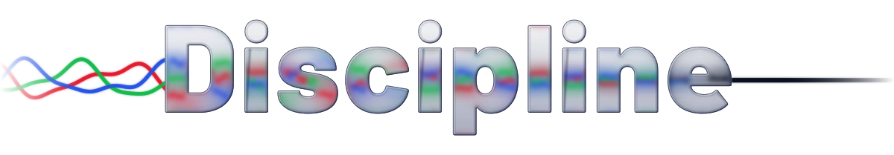

  <picture>
    <source media="(prefers-color-scheme: dark)" srcset="logo/logo-dark.svg">
    
  </picture>

# discipline
An inverted economic model for agentic coding: Ephemeral interview forks inform a rolling summary of your session, separating signal from noise and preventing your LLM from paying "full freight" on the 300kb HTML file it read to answer a simple question in turn two.
