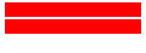

# Logo dark-mode experiment

Flip your OS / GitHub theme between light and dark; each logo should stay legible.
Grey background strips are not used on purpose: the page background is the test.

A. CSS `@media (prefers-color-scheme: dark)` inside the SVG, via ``:

B. `feColorMatrix` invert filter, enabled by the same media query, via ``:

C. Two files with `<picture>` (GitHub's documented approach):

<picture>
  <source media="(prefers-color-scheme: dark)" srcset="dark.svg">
  
</picture>

D. Two files selected by GitHub's own CSS via URL fragment (deprecated syntax; may not work):

Mismatch test: set GitHub to light (Settings > Appearance) with the OS in dark, then reverse.
Exactly one logo should be visible per row A-D if it follows GitHub's theme.

E. Does an `` SVG blend with the page behind it? Three bars: a plain red one, a red one with
`mix-blend-mode: difference`, and a white one with `difference`. If the image is isolated (Chromium in
a local test) all three ignore the page: red, red, and white (invisible on a light page). If it blends
with the page (WebKitGTK in a local test) the second turns cyan and the third black on a light page.
Look at it in light and dark GitHub themes, on your phone:

