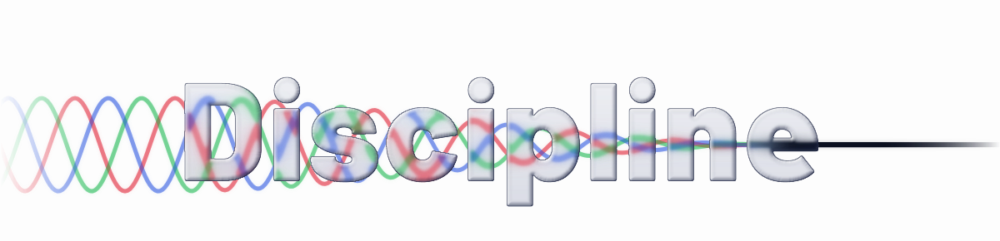
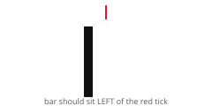

# Logo options

Generated by `../build.py --options`. Each is served as a `<picture>` pair, so what you see follows your GitHub theme.

### bloom

Light trapped in the glass: bloom inside each letter, streaked along the direction of travel, with chamfers that pick up the beam's colour.

<picture>
  <source media="(prefers-color-scheme: dark)" srcset="logo-dark-bloom.svg">
  
</picture>

### elements

The same glass with no displacement filter: the waves are bent where they cross each bezel and drawn as ordinary paths, the glow is layered copies, the rim light is stroked along the outline. Only plain blurs remain.

<picture>
  <source media="(prefers-color-scheme: dark)" srcset="logo-dark-elements.svg">
  
</picture>

### early

The other quadratic taper: the waves calm almost at once and leave a long quiet tail. Every other option uses the ease-in taper, which stays lively through most of the word and settles into the `e`.

<picture>
  <source media="(prefers-color-scheme: dark)" srcset="logo-dark-early.svg">
  
</picture>

### filter

Noise to signal: each waveform carries harmonics that the glass strips away letter by letter, so the tangle on the left resolves into one line.

<picture>
  <source media="(prefers-color-scheme: dark)" srcset="logo-dark-filter.svg">
  
</picture>

### caustic

Glass that spills light: a coloured caustic falls from the letters onto the page.

<picture>
  <source media="(prefers-color-scheme: dark)" srcset="logo-dark-caustic.svg">
  
</picture>

### liquid

Same light, softer glass: a wide bezel that bends more of the beam and a rim light that spreads.

<picture>
  <source media="(prefers-color-scheme: dark)" srcset="logo-dark-liquid.svg">
  
</picture>

### pick

Noise to signal, with bloom and a faint spill. The combination I would ship.

<picture>
  <source media="(prefers-color-scheme: dark)" srcset="logo-dark-pick.svg">
  
</picture>

### Does `feImage` with a `data:` URI work on your device?

`bloom`, `early`, `liquid`, `filter`, `caustic` and `pick` bake refraction into PNGs and read them with `feImage`. `elements` uses no `feImage` and no displacement filter, only masks, clips and plain blurs. If the others look flat and `elements` looks right, `feImage` is the problem. The small test below shows it directly: the bar should sit visibly left of the red tick.

