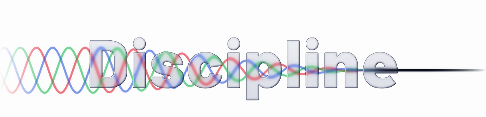
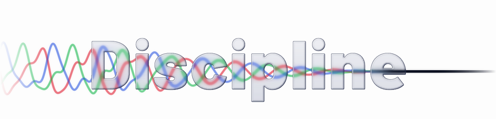
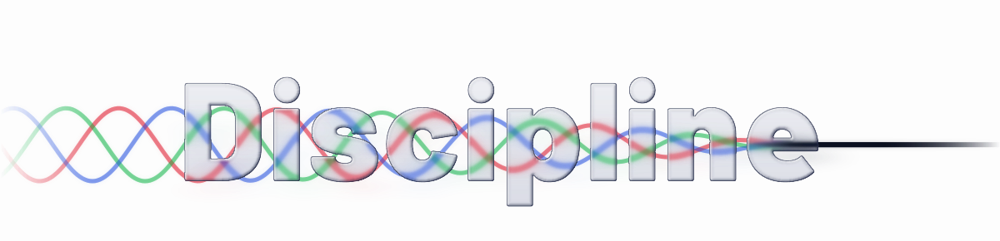
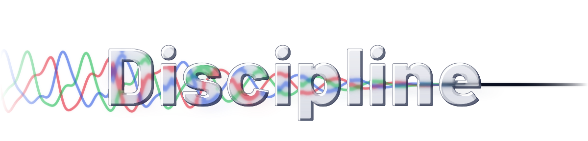

# Logo options

Generated by `../build.py --options`. Each is served as a `<picture>` pair, so what you see follows your GitHub theme.

### bloom

Light trapped in the glass: bloom inside each letter, streaked along the direction of travel, with chamfers that pick up the beam's colour.

<picture>
  <source media="(prefers-color-scheme: dark)" srcset="logo-dark-bloom.svg">
  
</picture>

### filter

Noise to signal: each waveform carries harmonics that the glass strips away letter by letter, so the tangle on the left resolves into one line.

<picture>
  <source media="(prefers-color-scheme: dark)" srcset="logo-dark-filter.svg">
  
</picture>

### prism

Dispersion: red, green and blue bend by different amounts, so the beam fringes at every chamfer. Dark only; the light pair shows the plain bloom version.

<picture>
  <source media="(prefers-color-scheme: dark)" srcset="logo-dark-prism.svg">
  
</picture>

### caustic

Glass that spills light: a coloured caustic falls from the letters onto the page.

<picture>
  <source media="(prefers-color-scheme: dark)" srcset="logo-dark-caustic.svg">
  
</picture>

### pick

Noise to signal, with bloom and a faint spill. The combination I would ship.

<picture>
  <source media="(prefers-color-scheme: dark)" srcset="logo-dark-pick.svg">
  
</picture>
