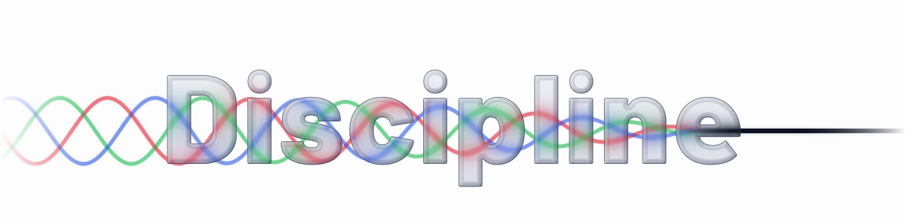
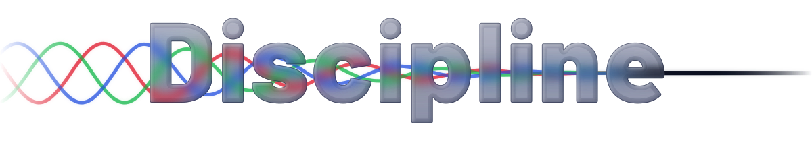
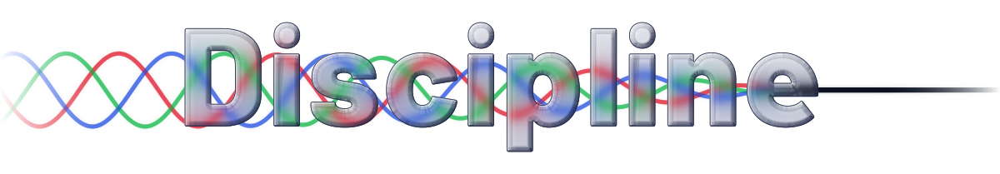
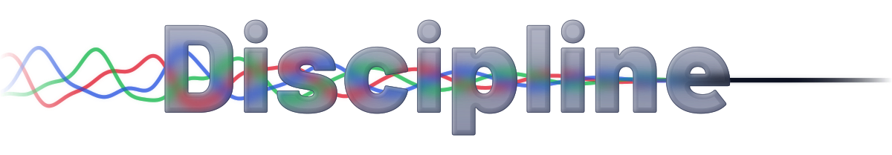
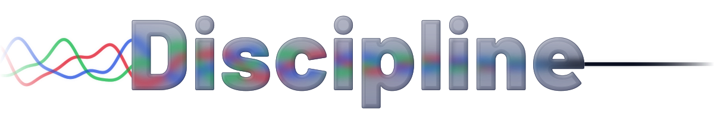
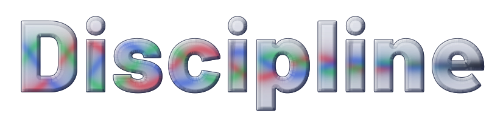
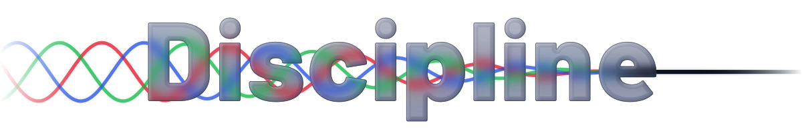
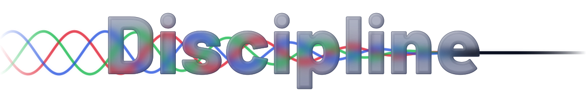
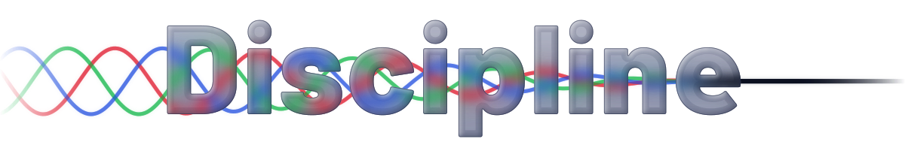
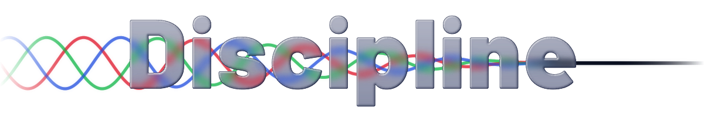

# Logo options

Generated by `../build.py --options`. Each is served as a `<picture>` pair, so what you see follows your GitHub theme.

### elements

The default. Glass built from elements (no displacement filter), a taper halfway between early and late, and a stronger, blurrier, more specular look than before.

<picture>
  <source media="(prefers-color-scheme: dark)" srcset="logo-dark-elements.svg">
  
</picture>

### early

The waves calm almost at once and leave a long quiet tail (quadratic ease-out).

<picture>
  <source media="(prefers-color-scheme: dark)" srcset="logo-dark-early.svg">
  
</picture>

### late

The waves stay lively through most of the word and settle into the `e` (quadratic ease-in).

<picture>
  <source media="(prefers-color-scheme: dark)" srcset="logo-dark-late.svg">
  
</picture>

### noise

Signal from noise: each waveform carries harmonics that the glass strips away letter by letter, so the tangle on the left resolves into one line.

<picture>
  <source media="(prefers-color-scheme: dark)" srcset="logo-dark-noise.svg">
  
</picture>

### story

The light enters the `D` and leaves the `e`, and between them it is visible only inside the letters: the gaps and counters are dark. The incoming waves and the outgoing beam are drawn as usual.

<picture>
  <source media="(prefers-color-scheme: dark)" srcset="logo-dark-story.svg">
  
</picture>

### story-noise

Both ideas: a tangle of harmonics enters the `D`, the glass strips them letter by letter, and between the first and last letter the light is visible only inside the glass. One clean beam leaves the `e`.

<picture>
  <source media="(prefers-color-scheme: dark)" srcset="logo-dark-story-noise.svg">
  
</picture>

### inside

The letters are a window and nothing is drawn outside them, not even the ends. The canvas is cropped to the word.

<picture>
  <source media="(prefers-color-scheme: dark)" srcset="logo-dark-inside.svg">
  
</picture>

### refract

The `elements` glass, but the waves are bent by a displacement filter (one `feImage` map, one `feDisplacementMap`) instead of at build time, so the lines stay plain paths a future animation can move. True refraction strength.

<picture>
  <source media="(prefers-color-scheme: dark)" srcset="logo-dark-refract.svg">
  
</picture>

### refract-strong

`refract` with the displacement scaled up (`REFRACT_GAIN`), as `elements` exaggerates it.

<picture>
  <source media="(prefers-color-scheme: dark)" srcset="logo-dark-refract-strong.svg">
  
</picture>

### refract-liquid

`refract-strong` with the wide, thick `liquid` bezel, which throws light much further at the rim.

<picture>
  <source media="(prefers-color-scheme: dark)" srcset="logo-dark-refract-liquid.svg">
  
</picture>

### refract-story-noise

`story-noise` with the waves bent by the displacement filter at `REFRACT_GAIN`.

<picture>
  <source media="(prefers-color-scheme: dark)" srcset="logo-dark-refract-story-noise.svg">
  
</picture>

### filter-glass

The previous glass, which bends the light with a displacement filter and two baked maps. Renders on iPhone Safari via GitHub. Kept as a fallback and a comparison.

<picture>
  <source media="(prefers-color-scheme: dark)" srcset="logo-dark-filter-glass.svg">
  
</picture>
